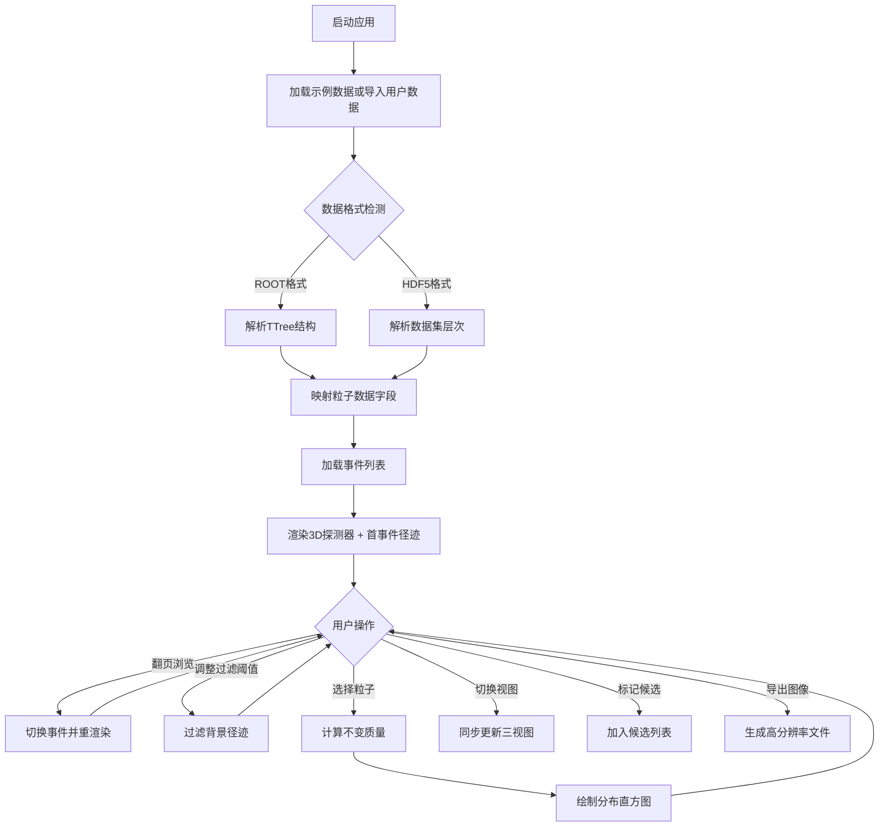

## 1. 产品概述

高能物理粒子对撞事件可视化工具是面向实验物理学家的专业数据分析与可视化平台，用于直观展示探测器内粒子对撞产生的径迹、能量沉积和物理量分布，辅助研究人员快速筛选特征事件、进行物理分析并产出发表级图表。

- 目标用户：粒子物理实验研究员、博士研究生、数据分析工程师
- 核心价值：将抽象的探测器数据转化为直观的三维可视化，加速物理分析流程，提升候选事件筛选效率

## 2. 核心特性

### 2.1 功能模块总览

1. **主工作区**：三维探测器可视化视图 + 横/纵截面联动视图
2. **数据导入面板**：ROOT/HDF5格式事件数据导入，内置模拟示例数据
3. **粒子渲染系统**：四种粒子类型（电子/缪子/光子/喷注）差异化渲染
4. **过滤器控制面板**：动量阈值、粒子类型、能量范围等多维度过滤
5. **事件浏览器**：逐事件翻页、事件列表快速跳转、候选事件标记
6. **能量沉积热力图**：探测器各子系统能量空间分布可视化
7. **物理分析工具**：双粒子不变质量计算、直方图统计分布
8. **图像导出模块**：论文级高分辨率PNG/SVG/PDF格式导出

### 2.2 页面详情

| 页面名称 | 模块名称 | 功能描述 |
|---------|---------|----------|
| 主工作台 | 顶部导航栏 | 数据导入、导出、视图切换、全局设置 |
| 主工作台 | 3D主视图 | 探测器几何体渲染、粒子径迹三维展示、交互控制 |
| 主工作台 | 横截面视图 (XY) | 垂直束流管方向的投影视图，与3D视图联动 |
| 主工作台 | 纵截面视图 (RZ) | 沿束流管方向的投影视图，与3D视图联动 |
| 主工作台 | 左侧控制面板 | 事件导航、过滤参数、显示选项 |
| 主工作台 | 右侧信息面板 | 粒子列表、物理量详情、不变质量分析 |
| 主工作台 | 底部分析区 | 不变质量直方图、能量分布统计 |
| 数据导入弹窗 | 文件选择器 | 拖放或选择ROOT/HDF5文件，格式自动检测 |
| 数据导入弹窗 | 配置项 | 树名选择、事件范围、分支映射 |
| 导出对话框 | 格式选项 | PNG(可调DPI)/SVG/PDF，尺寸预设 |
| 导出对话框 | 范围选择 | 当前视图/所有视图/仅图表 |

## 3. 核心流程

### 3.1 主用户流程

## 4. 用户界面设计

### 4.1 设计风格

**美学方向：科研专业深色主题 (Scientific Dark Theme)**
- 主色调：深空蓝灰 (#0B1020) 背景 + 冷白 (#E8ECF4) 正文
- 强调色：
  - 电子：青蓝色 #00D4FF (固态线)
  - 缪子：品红色 #FF4081 (长虚线)
  - 光子：金黄色 #FFD54F (点线，无径迹)
  - 喷注：橙色渐变 #FF6D00→#FFAB00 (圆锥体)
  - 能量热力：蓝→青→绿→黄→红 渐变色带
- 辅助色：
  - 探测器几何：半透明银灰 #8899AA (10%不透明度)
  - 束流管：淡绿色轴 #00FF88
  - UI控件边框：#2A3352
- 字体：
  - 标题：JetBrains Mono (等宽科研字体，营造终端/控制台质感)
  - 正文：Fira Sans (高可读性无衬线)
  - 数据/数值：JetBrains Mono
- 按钮风格：扁平化直角微内凹，按下有轻微发光反馈
- 布局风格：科学软件经典多面板布局 (Multi-Pane Dock)，可拖拽分隔条
- 图标风格：线性SVG图标，1.5px描边，物理领域语义化符号

### 4.2 页面设计概览

| 页面名称 | 模块名称 | UI元素 |
|---------|---------|--------|
| 主工作台 | 顶部导航栏 | 深色玻璃态背景，等宽字体logo，分隔按钮组，状态指示器 |
| 主工作台 | 3D主视图 | 无边框内嵌渲染器，右上角HUD信息(事件号/粒子数/总能量) |
| 主工作台 | 横/纵截面 | 直角边框内嵌，左上角视图标签，底部刻度尺 |
| 主工作台 | 左侧面板 | 可折叠分组卡片，滑块控件带实时数值显示 |
| 主工作台 | 右侧面板 | 可排序数据表格，行悬停高亮对应粒子 |
| 主工作台 | 底部分析区 | 可展开图表区，直方图带坐标轴标签和统计信息 |
| 所有面板 | 分隔条 | 5px宽透明热区，悬停变为强调色，可拖拽 |

### 4.3 响应式设计

- Desktop-first 设计，最小支持分辨率 1600×900
- 多面板采用 CSS Grid + 自定义可拖拽分隔条实现布局
- 2K/4K 屏下通过 rem 缩放自动适配
- 面板折叠状态保存在 localStorage

### 4.4 3D场景指引

- **环境**：纯深空背景 #050810，无HDRI，避免反射干扰科研数据
- **光照**：三路环境光 + 方向光组合
  - 环境光强度 0.4 (保证探测器半透明结构可见)
  - 主方向光 (0, 1, 1) 强度 0.8，产生轻微阴影
  - 补光 (-1, -1, 0) 强度 0.3
- **相机**：PerspectiveCamera fov=50，初始距离 1500 单位，初始视角 45°俯角
  - 支持轨道控制(OrbitControls)：缩放/旋转/平移
  - 双击粒子自动聚焦(Zoom to Fit)
- **渲染器**：WebGLRenderer antialias=true, alpha=true, 支持后处理Bloom发光效果(仅粒子径迹端点)
- **性能**：
  - 粒子径迹使用 LineSegments + BufferGeometry，单DrawCall
  - 探测器子系统使用 InstancedMesh
  - 目标帧率 ≥ 30fps (1000条径迹量级)
