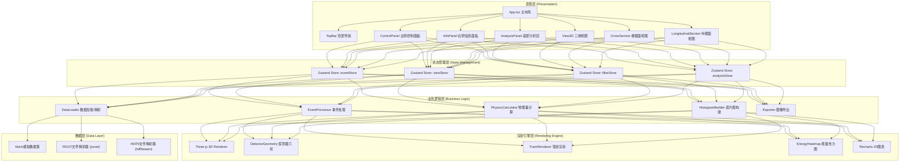

## 1. 架构设计



## 2. 技术选型说明

| 层级 | 技术 | 版本 | 用途 |
|------|------|------|------|
| 构建工具 | Vite | ^5.0 | 极速开发服务器与生产构建 |
| 框架 | React | ^18.2 | UI组件化开发 |
| 语言 | TypeScript | ^5.3 | 类型安全，编译期错误捕获 |
| 样式 | TailwindCSS | ^3.4 | 原子化CSS，快速构建UI |
| 状态管理 | Zustand | ^4.4 | 轻量级、非侵入式状态容器 |
| 3D渲染 | Three.js | ^0.160 | WebGL三维场景渲染 |
| 3D交互 | @react-three/fiber | ^8.15 | React声明式Three.js封装 |
| 3D辅助 | @react-three/drei | ^9.92 | 常用3D组件(OrbitControls等) |
| 2D图表 | Recharts | ^2.10 | 直方图/分布图绘制 |
| 数学计算 | mathjs | ^12.2 | 矩阵运算、数值积分 |
| 文件处理 | jsroot | ^7.7 | CERN ROOT文件浏览器解析 |
| 图像导出 | html-to-image | ^1.11 | DOM节点转高分辨率PNG/SVG |
| UI组件 | lucide-react | ^0.303 | 线性SVG图标库 |

## 3. 路由定义

| 路由 | 页面组件 | 功能说明 |
|------|---------|---------|
| `/` | `Workspace.tsx` | 主工作台（唯一页面，单页应用） |

> 本工具为单页应用(SPA)，所有功能模块在主工作台内通过面板/弹窗形式呈现，无多页面路由。

## 4. 数据模型定义

### 4.1 核心实体模型

```mermaid
classDiagram
    class PhysicsEvent {
        +number eventId
        +number runNumber
        +number luminosityBlock
        +number timestamp
        +Particle[] particles
        +EnergyDeposit[] energyDeposits
        +number totalET
        +number missingET
    }

    class Particle {
        +number id
        +ParticleType type
        +number charge
        +number px
        +number py
        +number pz
        +number energy
        +number eta
        +number phi
        +number pt
        +number mass
        +Vector3[] trackPoints
        +Vertex vertex
        +boolean isSignal
    }

    class Vertex {
        +number x
        +number y
        +number z
    }

    class EnergyDeposit {
        +number detectorId
        +DetectorLayer layer
        +number eta
        +number phi
        +number z
        +number energy
    }

    class InvariantMassPair {
        +Particle particle1
        +Particle particle2
        +number invariantMass
        +number deltaR
    }

    class HistogramData {
        +string title
        +string xLabel
        +number[] bins
        +number binWidth
        +number xMin
        +number xMax
        +number entries
        +number mean
        +number rms
    }

    enum ParticleType {
        ELECTRON
        MUON
        PHOTON
        JET
        TAU
        BQUARK
    }

    enum DetectorLayer {
        PIXEL
        SCT
        TRT
        EM_CALO
        HAD_CALO
        MUON_CHAMBER
    }

    PhysicsEvent "1" --> "*" Particle
    PhysicsEvent "1" --> "*" EnergyDeposit
    Particle "1" --> "1" Vertex
    Particle --> ParticleType
    EnergyDeposit --> DetectorLayer
    InvariantMassPair "2" --> Particle
```

### 4.2 状态Store定义

```typescript
// eventStore.ts - 事件数据管理
interface EventState {
  events: PhysicsEvent[];
  currentEventIndex: number;
  loadedFormat: 'mock' | 'root' | 'hdf5' | null;
  candidateEventIds: Set<number>;
  get currentEvent(): PhysicsEvent | null;
  loadMockData: () => Promise<void>;
  loadFromROOT: (file: File, config: ROOTConfig) => Promise<void>;
  loadFromHDF5: (file: File, config: HDF5Config) => Promise<void>;
  gotoEvent: (index: number) => void;
  nextEvent: () => void;
  prevEvent: () => void;
  toggleCandidate: (eventId: number) => void;
}

// filterStore.ts - 过滤器管理
interface FilterState {
  ptThreshold: number;
  etaRange: [number, number];
  energyRange: [number, number];
  visibleParticleTypes: Set<ParticleType>;
  showOnlySignal: boolean;
  getFilteredParticles: (event: PhysicsEvent) => Particle[];
  setPtThreshold: (v: number) => void;
  toggleParticleType: (type: ParticleType) => void;
}

// viewStore.ts - 视图状态管理
interface ViewState {
  leftPanelCollapsed: boolean;
  rightPanelCollapsed: boolean;
  bottomPanelCollapsed: boolean;
  leftPanelWidth: number;
  rightPanelWidth: number;
  bottomPanelHeight: number;
  showEnergyHeatmap: boolean;
  heatmapOpacity: number;
  showDetectorGeometry: boolean;
  selectedParticleIds: Set<number>;
  syncViews: boolean;
  togglePanel: (panel: 'left' | 'right' | 'bottom') => void;
  setPanelSize: (panel: string, size: number) => void;
  toggleParticleSelection: (id: number) => void;
  clearSelection: () => void;
}

// analysisStore.ts - 分析结果管理
interface AnalysisState {
  selectedPairs: InvariantMassPair[];
  massHistogram: HistogramData | null;
  addPair: (p1: Particle, p2: Particle) => void;
  removePair: (index: number) => void;
  buildMassHistogram: (bins: number, xMin: number, xMax: number) => void;
  clearAnalysis: () => void;
}
```

## 5. 项目目录结构

```
src/
├── assets/                 # 静态资源
│   └── fonts/              # 自定义字体
├── components/             # UI组件
│   ├── layout/             # 布局相关
│   │   ├── TopBar.tsx
│   │   ├── ControlPanel.tsx
│   │   ├── InfoPanel.tsx
│   │   ├── AnalysisPanel.tsx
│   │   └── ResizableSplit.tsx
│   │   └── Workspace.tsx
│   ├── views/              # 视图渲染
│   │   ├── View3D/
│   │   │   ├── View3D.tsx
│   │   │   ├── DetectorGeometry.tsx
│   │   │   ├── TrackRenderer.tsx
│   │   │   ├── JetCone.tsx
│   │   │   └── EnergyHeatmap.tsx
│   │   ├── CrossSection.tsx
│   │   ├── LongitudinalSection.tsx
│   │   └── HistogramChart.tsx
│   ├── controls/           # 控制面板组件
│   │   ├── EventNavigator.tsx
│   │   ├── FilterControls.tsx
│   │   └── ViewOptions.tsx
│   ├── dialogs/            # 弹窗组件
│   │   ├── ImportDialog.tsx
│   │   └── ExportDialog.tsx
│   └── common/             # 通用组件
│       ├── Slider.tsx
│       ├── Switch.tsx
│       ├── DataTable.tsx
│       └── Legend.tsx
├── store/                  # Zustand状态管理
│   ├── eventStore.ts
│   ├── filterStore.ts
│   ├── viewStore.ts
│   └── analysisStore.ts
├── services/               # 业务逻辑服务
│   ├── mockData/           # 模拟数据生成
│   │   └── eventGenerator.ts
│   ├── parsers/            # 数据解析器
│   │   ├── ROOTParser.ts
│   │   └── HDF5Parser.ts
│   ├── physics/            # 物理计算
│   │   ├── kinematics.ts
│   │   └── detectorGeometry.ts
│   ├── analysis/           # 统计分析
│   │   └── histogram.ts
│   └── export/             # 图像导出
│       └── imageExporter.ts
├── types/                  # TypeScript类型定义
│   ├── physics.ts
│   └── ui.ts
├── utils/                  # 工具函数
│   ├── colors.ts           # 粒子配色方案
│   └── format.ts           # 数值格式化
├── hooks/                  # 自定义Hooks
│   ├── useResizable.ts
│   └── useKeyboardShortcuts.ts
├── styles/                 # 全局样式
│   └── globals.css
├── App.tsx
├── main.tsx
└── vite-env.d.ts
```

## 6. 关键算法说明

### 6.1 不变质量计算
```
M² = (E₁ + E₂)² - (p⃗₁ + p⃗₂)²
   = (E₁+E₂)² - (px₁+px₂)² - (py₁+py₂)² - (pz₁+pz₂)²
```

### 6.2 粒子径迹参数化
利用螺旋线方程在均匀磁场中拟合带电粒子径迹：
```
x(φ) = x₀ + R·(cos(φ₀) - cos(φ₀+φ))
y(φ) = y₀ + R·(sin(φ₀+φ) - sin(φ₀))
z(φ) = z₀ + (s / √(1+cot²θ)) · φ
```
其中 R = pT/(0.3·B) 为曲率半径。

### 6.3 能量沉积热力图
将 calorimeter 按 η-φ 分桶，使用 log(E+1) 归一化后映射至 viridis 色带。
